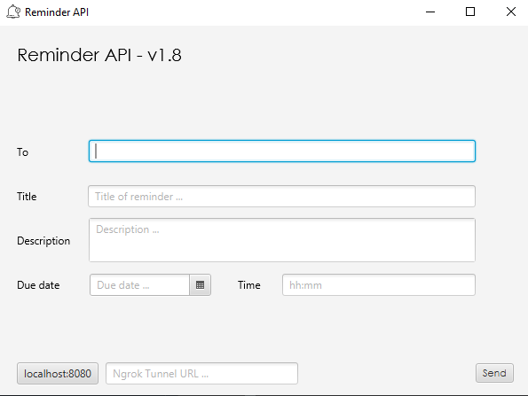

# Reminder API Client

User interface for [Reminder API](https://github.com/Horiapavel98/reminder-api)

Insert images here...

# Running Locally

To start this application locally, you need to add javafx as a library to your project.
You can check out information on how to do that [here](https://openjfx.io/openjfx-docs/)

This project uses Maven for build automation. Once JavaFX is configured, run:
   
    mvn clean javafx:compile javafx:run

Start the application.

    java -jar 

User interface

